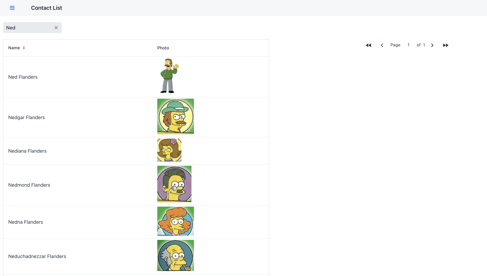

# Full Stack Application to view my contacts along with searching, sorting and pagination function

## Components and Tools:
 - Backend Spring Boot Microservice: 
 - Vaadin UI Components 
 - Data Source Handling with MySql and CSV File Reader
 - Maven Build Tool

## Getting Started with Contacts Application:
- Clone this repository
- Install JAVA:11+ Maven:3 Mysql(optional)
- Do the mvn build for contacts-list-application
- Lunch the Application Main 
- Note: Make sure you are connected to the internet to access the Vaadin server

## Contact List Application Screen:
### Main Screen

### Search Screen

### Pager Screen
